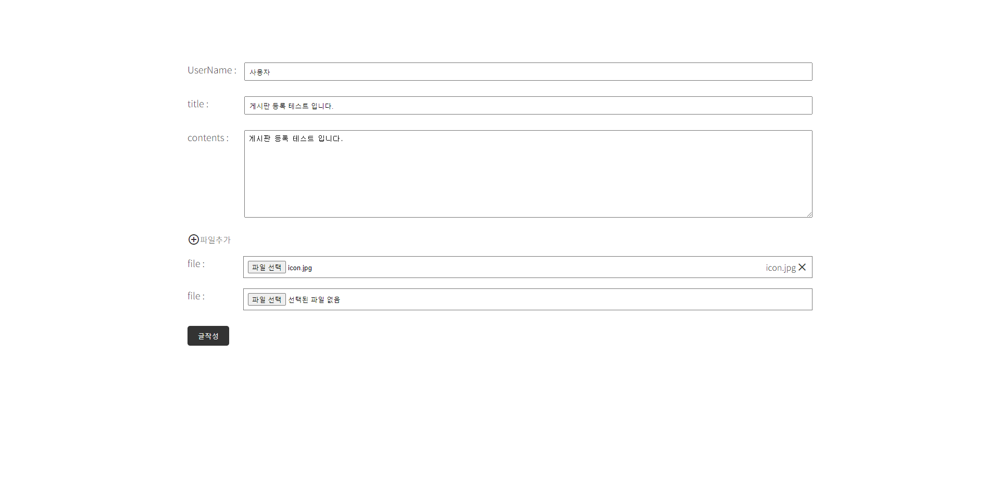
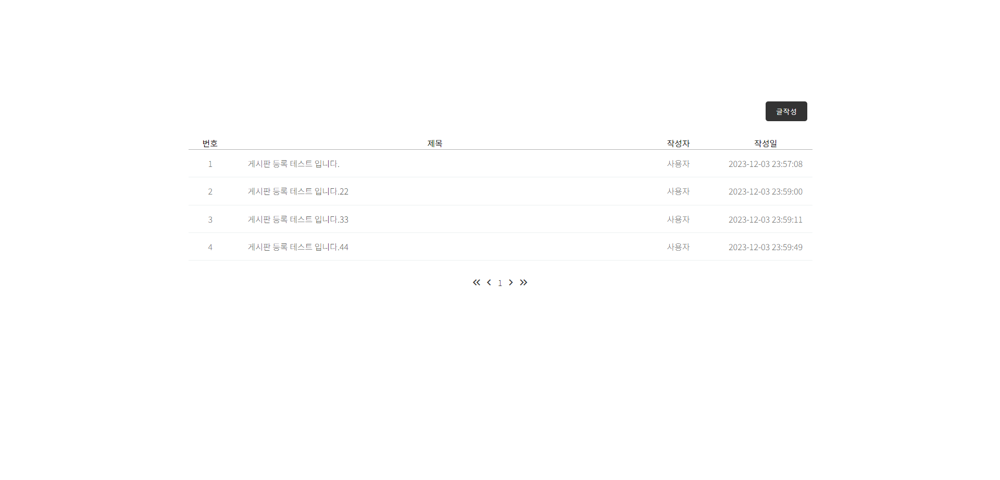
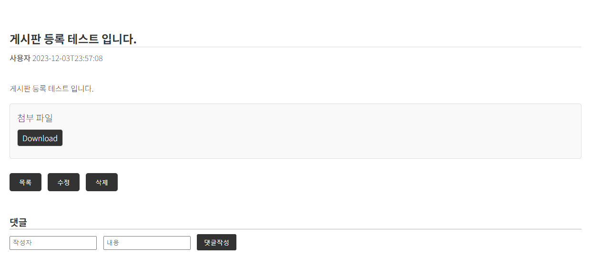
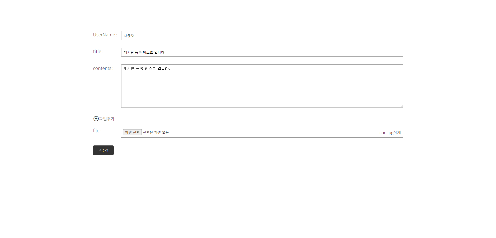

# 게시판 구현
SpringBoot, Thyemleaf, MySQL을 활용한 게시판 만들기

## 개발환경
- IDE: IntelliJ IDEA Community
- Gradle - Groovy, Java 17
- Jar 11
- Spring Boot 2.7.6
- jvm.convert 3.3.2
- JDK 11
- mysql 8.0.35
- Lombok
- Spring Web
- Spring Data JPA
- Thymeleaf
  

## 게시판 주요 기능
### 1. 글쓰기(/board/save)
- 홈화면, 글 목록 페이지에서 글 쓰기 버튼 클릭
- 파일(이미지)첨부하기 다중

### 2. 글목록(/board/, /board/paging)
- 한페이지에 게시글 5개씩
- 최대 3개 페이지
- /board/paging?page=1
- board/pading/1

### 3. 글조회(/board/{id})
- 게시글에 첨부한 파일(이미지) 다운(/download/{uuid}/{filename})

### 4. 글수정(/board/update/{id})
 - 상세화면에서 수정 버튼 클릭
 - 서버에서 해당 게시글의 정보를 가지고 수정 화면 출력
 - 제목, 내용 수정 입력 받아서 서버로 요청

### 5. 글삭제(/board/delete/{id})
- 상세페이지 글 삭제 버튼 클릭

### 6. 댓글
#### a. 댓글 추가(/comment/save)
#### b. 댓글 전체보기{/getComment/{id}}
#### c. 댓글 수정(/update/{id}/comments/{commentId})
#### d. 댓글 삭제(/delete/{id}/comments/{commentId})

  

## 향후 업데이트 예정 기능
#### 1. 다중 파일 첨부 이미지 덮어쓰기 기능

#### 2. 게시글 삭제 클릭시 alter창 띄우기

#### 3. kakaoLogin RestApi 기능 추가 예정
  

## 버전

### v1.4.2 (2023.11.29)
- [추가] 파일 업데이트, 수정, 삭제
- [추가] 레이아웃  

### v1.3.2 (2023.11.28)
- [추가] 게시글에 첨부한 파일(이미지) 다운(/download/{uuid}/{filename})
- [추가] 파일(이미지) 첨부 (단일/다중)
- [추가] 댓글 삭제(/delete/{id}/comments/{commentId})

### v1.2.2 (2023.11.27)
- [수정] 게시판 글 클릭시 작성된 댓글이 보이지 않는 오류 수정

### v1.2.1 (2023.11.24)
- [추가] 댓글 작성(/comment/save)
- [추가] 게시글에 달린 댓글들 보이기(/comment/comments)
- [수정] 페이징 오류 수정

### v1.1.0 (2023.11.23)
- [추가] 게시판 페이지 보기(/board/paging, /board/)
  - 한 페이지 5개씩
  - 페이지 최대 3개씩
- [추가] 게시글 작성 화면으로 이동(/board/create)
- [추가] 게시글 조회(/board/{id})
  - 글번호, 제목, 작성일, 내용
  - 목록, 수정, 삭제 버튼
- [추가] 게시글 수정(/board/update/{id})
- [추가] 게시글 수정 적용(/board/update)
- [추가] 게시글 삭제(/board/{id})

### v1.0.0 (2023.11.21)
- [추가] 게시글 작성(/board/save)
