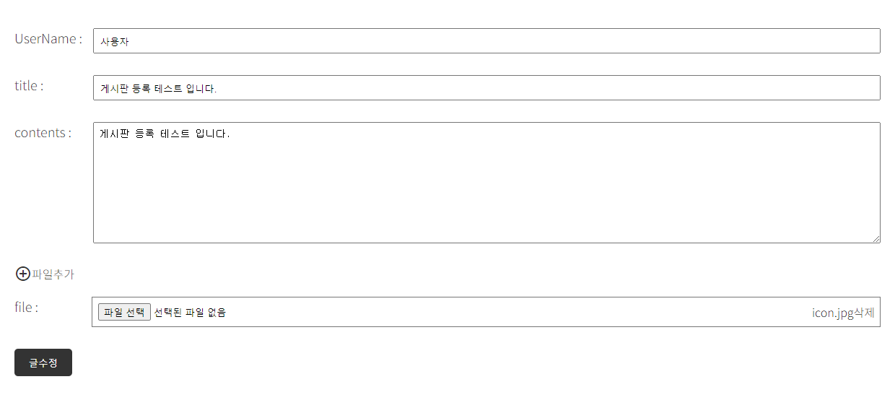

# 게시판 구현

## 버전
Board_v1.0.0

## 개발환경
- IDE: IntelliJ IDEA Community
- Spring Boot 2.7.6
- JDK 11
- mysql 8.0.35
- Spring Data JPA
- Thymeleaf

## 게시판 주요 기능
### 1. 글쓰기(/board/save)
- 홈화면, 글 목록 페이지에서 글 쓰기 버튼 클릭

### 2. 글목록(/board/)
 

### 3. 글조회(/board/{id})

### 4. 글수정(/board/update/{id})
 - 상세화면에서 수정 버튼 클릭
 - 서버에서 해당 게시글의 정보를 가지고 수정 화면 출력
 - 제목, 내용 수정 입력 받아서 서버로 요청

## 수정 처리
### 1. 글삭제(/board/delete/{id})

### 2. 페이징처리(/board/paging)
 - /board/paging?page=1
 - /board/paging/1

### 3. 게시글
 - 한페이지에 5개씩 => 3개
 - 한페이지에 3개씩 => 5개

### 4. 파일(이미지)첨부하기

### 5. 댓글 기능 추가
- 수정 , 삭제 기능 구현 완료

## 향후 업데이트 예정 기능
### 1. 다중 파일 첨부

### 2. 게시글 삭제 클릭시 alter창 띄우기
